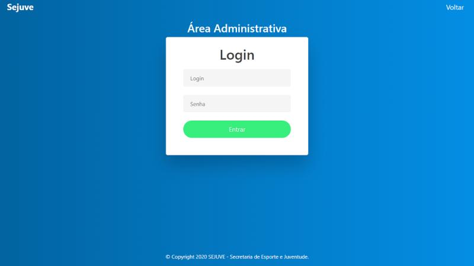
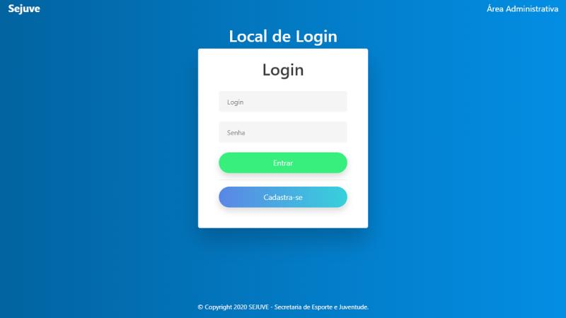

# 🏆 Sistema Web de Gestão de Competições Esportivas Municipais

Sistema web desenvolvido para o Departamento Municipal de Esportes, com foco na automatização do processo de inscrição de equipes em competições municipais, substituindo formulários manuais por uma solução digital centralizada.

O projeto contempla área administrativa, cadastro de equipes, gerenciamento de competições e controle das inscrições, garantindo mais agilidade, organização e confiabilidade dos dados.

---

## 📸 Prints do Sistema 

### Teka de Login - Área Administratia
Interface de autenticação para acesso restrito à área administrativa do sistema

---

### 🏟️ Lega de Login - Usuário
Tela de login para o usuário entrar no sistema.

---

## Funcionalidades
- 🔐 Autenticação de usuários administrativos

- 📝 Cadastro e gerenciamento de equipes

- 🏆 Criação e controle de competições esportivas

- 🔄 Inscrição automatizada de equipes

- 🗄️ Persistência de dados em banco relacional

- 💻 Interface web simples e funcional

---

## 🛠️ Tecnologias Utilizadas

### Back-end

- PHP

- MySQL

- Integração com banco de dados relacional

- Processamento de formulários e regras de negócio

### Front-end

- JavaScript

- HTML5

- CSS3

## 🗄️ Banco de Dados

O banco de dados foi modelado para armazenar:

Usuários administrativos

Equipes esportivas

Competições municipais

Inscrições das equipes

Utilizando MySQL, garantindo integridade e organização dos dados.
